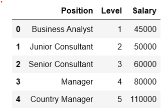

# Implementation-of-Decision-Tree-Regressor-Model-for-Predicting-the-Salary-of-the-Employee

## AIM:
To write a program to implement the Decision Tree Regressor Model for Predicting the Salary of the Employee.

## Equipments Required:
1. Hardware – PCs
2. Anaconda – Python 3.7 Installation / Jupyter notebook

## Algorithm
1. Initialize the dataset using the pandas library
2. Have a look at the dataset using df.head() and df.info() to make any changes
3. Convert the string columns to numerical values to fit in to the regressor
4. Split the dataset to train and test and then fit that data to the DecisionTreeRegressor
5. Evaluate the model on metrics like mse and r2 score
6. Predict values of Salary using the trained model

## Program:
```
/*
Program to implement the Decision Tree Regressor Model for Predicting the Salary of the Employee.
Developed by: RAMESH RENUKA
RegisterNumber: 212223240136 
*/
```
```
import pandas as pd
data=pd.read_csv('Salary.csv')
data.head()
```

## Output:


```
data.info()
```
## Output:


```
data.isnull().sum()
```
## Output:


```
from sklearn.preprocessing import LabelEncoder
le=LabelEncoder()
data['Position']=le.fit_transform(data['Position'])
data.head()
```
## Output:


```
x=data[["Position","Level"]]
y=data["Salary"]

from sklearn.model_selection import train_test_split
x_train,x_test,y_train,y_test=train_test_split(x,y,test_size=0.2,random_state=2)

from sklearn.tree import DecisionTreeRegressor
dt=DecisionTreeRegressor()
dt.fit(x_train,y_train)
y_pred=dt.predict(x_test)
from sklearn import metrics
mse=metrics.mean_squared_error(y_test,y_pred)
mse
```
## Output:


```
r2=metrics.r2_score(y_test,y_pred)
r2
```
## Output:


```
dt.predict([[5,6]])
```
## Output:


## Result:
Thus the program to implement the Decision Tree Regressor Model for Predicting the Salary of the Employee is written and verified using python programming.
